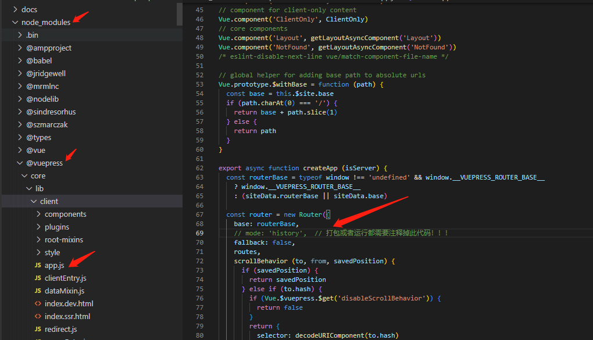

# Akai Blog 

#### 介绍
基于vuepress搭建的个人博客项目。文章采用markdown语法编写。目前部署于uniCloud。

项目地址：https://static-mp-cc9def39-a2c5-4a82-886d-6c9225613652.next.bspapp.com

项目地址：域名备案正在审核中...(https://salephine.asia)

项目地址(gitee)：https://gitee.com/AkaiBlog/akai-blog

#### 软件架构

VuePress、Webpack

#### 安装使用教程

1. 拉取项目之后首先查看是否有包管理文件(package.json)

2. 如果有包管理文件执行以下代码

   1.  npm install / npm i  / yarn / yarn add 
   2.  查看 `docs`目录下的`.vuepress`目录下的`config.js`文件内的`base:'./,'`代码模块是否**已注释**(已注释则可执行第三步,若没有注释先行注释掉此代码)
   3.  npm run dev /  yarn dev

3. 关于项目打包

   1. 首先将 `docs`目录下的`.vuepress`目录下的`config.js`文件内的`base:'./,'`解开注释。(**一定要将注释解开，否则在打包时会出现样式错乱**)

   2. 然后找到`node_modules`下的如下文件，**然后注释掉app.js中的`mode:'history'`。**

#### 参与贡献

2.  Don't need write anything,cloning project makes it your project!

#### 答疑解惑

1. 如有疑问，联系作者 QQ   `1494598731`       WeChat    `Akaibiu`